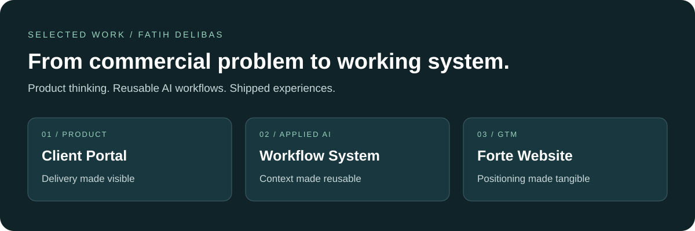
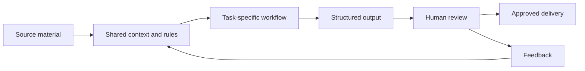

# Fatih Delibas
### Product Growth · GTM · Applied AI

I turn customer insight and commercial requirements into products, workflows and growth experiments. This portfolio brings together a client portal, a shared AI workspace and a live business website built through my work at Forte Growth.

**[Explore the live portal demo](https://portal.fortegrowth.co/demo)** · **[Visit the website](https://www.fortegrowth.co/)** · **[Connect on LinkedIn](https://www.linkedin.com/in/delibasfatih/)**

## Start here

| Project | What to inspect | What it demonstrates |
| --- | --- | --- |
| **[Client GTM Portal](case-studies/client-portal.md)** | A public demo with sprint progress, campaigns, metrics and deliverables | Translating a delivery process into a usable product |
| **[AI Workflow System](case-studies/ai-workflow-system.md)** | Shared skills, workflow contracts, review steps and feedback loops | Making LLM-assisted work repeatable across a team |
| **[Forte Website](case-studies/forte-website.md)** | A live commercial website developed with AI assistance | Connecting positioning, product presentation and a clear next step |

## My contribution

At Forte Growth, I work across growth strategy, customer insight, GTM planning and AI-assisted implementation. My work includes reusable research and campaign workflows, client GTM hubs and the website build. I use AI tools as part of the development process and make the work inspectable through documentation, examples and live products.

These projects sit within a team business. This portfolio describes my contribution; it does not attribute every company outcome or every line of code to me.

Before Forte, at Sensor Tower, I helped grow StayFree Desktop from launch to **55K+ active devices**, supported its browser extension beyond **1M active users**, and managed close to **$500K in paid acquisition spend**. Those are results from that earlier role, separate from the projects shown here.

## Look inside a workflow

Two small examples show how I structure AI-assisted work:

- **[Meeting notes → action package](examples/meeting-to-actions.md):** decisions, evidence, owners, unknowns and completion criteria.
- **[Meeting notes → content brief → draft](examples/content-workflow.md):** source facts, a writing brief and a draft for human review.

Both examples were created for this public portfolio using fictional inputs. They illustrate the approach; they are not client deliverables, production logs or measured model evaluations.

## Working with AI

My focus is applied AI for growth and commercial operations: clear inputs, reusable context, explicit output requirements and reviewable results. Claude Code, Claude, ChatGPT and n8n feature in my broader toolkit. Each case study distinguishes a live product, a documented workflow and a portfolio illustration.

The public repository contains original case-study summaries and illustrative examples. The operational repositories remain private. See [scope and evidence](SCOPE.md) for what is demonstrated and what is not claimed.

## Roles I am interested in

Remote Product Growth, Growth PM, GTM, Growth Marketing, Product Marketing and AI/Commercial Innovation opportunities.

**[View my background and get in touch on LinkedIn](https://www.linkedin.com/in/delibasfatih/).**
