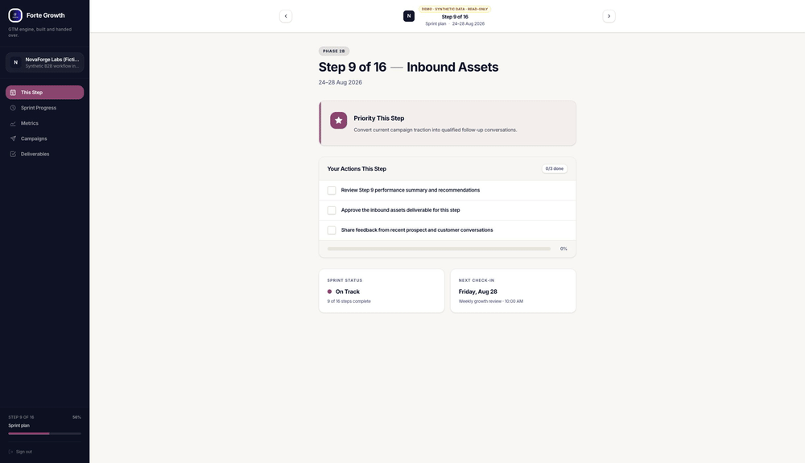
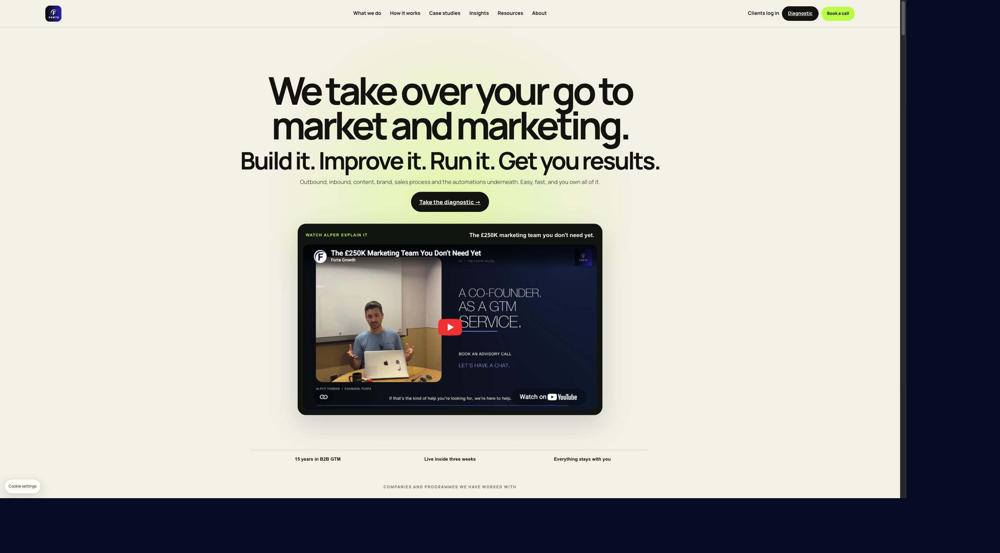

# Fatih Delibas / A world in play

I connect customer insight, commercial thinking and hands-on building to make products and systems people can use.

**[Explore the visual portfolio](https://coop05.github.io/ai-growth-portfolio/)** · **[Explore the live portal](https://portal.fortegrowth.co/demo)** · **[Forte website](https://www.fortegrowth.co/)** · **[Let's talk](https://www.linkedin.com/in/delibasfatih/)**

## 01 / Client GTM portal

A client GTM portal bringing the next action, delivery progress and campaign signals into one workspace. My contribution connects customer research and GTM planning with AI-assisted implementation.

*Three captured views of the public synthetic demo. [View a still](assets/portal-metrics.png) · [Open the live product](https://portal.fortegrowth.co/demo)*

**Three decisions behind the product:** start with the next action; give performance numbers context; distinguish plan progress from completed work.

[Read the product case study](case-studies/client-portal.md)

## 02 / AI workflow system

A shared AI workspace for research, content and GTM delivery. Reusable context, explicit outputs and feedback that stays with the team.

| Source | Working system | Reviewable output |
|---|---|---|
| Customer conversations | Shared context + task-specific workflows | Decisions, owners and next steps |
| Meeting notes | Writing brief + evidence checks | Review-ready content drafts |

[Explore the system](case-studies/ai-workflow-system.md) · [Inspect an action package](examples/meeting-to-actions.md) · [Inspect a content workflow](examples/content-workflow.md)

## 03 / Forte Growth website

A live commercial website connecting a complex GTM offer with clear customer situations, product evidence and a next step. Built through AI-assisted development as part of my work at Forte Growth.

[Visit the website](https://www.fortegrowth.co/) · [Read the case study](case-studies/forte-website.md)

## Experience behind the work

Before Forte, at **Sensor Tower**, I helped grow StayFree Desktop from launch to **55K+ active devices**, supported its browser extension beyond **1M active users**, and managed close to **$500K in paid acquisition spend**. I conducted **40+ user interviews per month**, working with Product, Engineering and Marketing.

Those results belong to that earlier role, separate from the Forte projects above.

## Something worth building together?

London-based. Product growth, GTM and applied AI.

**[Connect on LinkedIn](https://www.linkedin.com/in/delibasfatih/)**

---

Forte projects are team work; the case studies describe my contribution. Portal screenshots show the public synthetic demo. Workflow examples use fictional inputs. [Scope & evidence](SCOPE.md).

The responsive portfolio in `index.html` is a continuous, original 3D world with a tennis island, a fantasy racing circuit and a gallery of actual projects. Scrolling moves the camera through the world; dragging changes the view. Six original voxel fan characters represent Federer, Nadal, Djokovic, Verstappen, Vettel and Schumacher. These are unofficial artistic tributes with no implied endorsement.

The tennis game includes player movement, a timed return window, an opponent, ball bounces, an eight-return objective and restart controls. The racing game includes steering, braking, barriers, a two-lap objective, collision tracking and a timer. In tennis, click or tap the court to serve or swing; drag to position the player. In racing, click, tap or drag to choose a line. Arrow keys, Space and the on-screen controls remain available. Both games have an explicit exit. All six characters are selectable. The paddock has a separate pit lane, barrier, service apron and smooth one-way entrance and exit connections. Project screenshots retain their full natural proportions in both the page and the 3D gallery.

The page uses Manrope throughout. Presentation lives in `style.css` and `script.js`; Three.js r150 is vendored in `three.min.js` under its MIT licence. Static geometry uses instanced batches, rendering stops when the tab is hidden, and reduced-motion preferences start the ambient world paused. A pause button controls ambient motion. Explicitly starting a game enables the motion needed to play. When WebGL is unavailable, `software-renderer.js` projects the same Three.js scene graph through Canvas, preserving the 3D world and games. Project and contact content also remains usable independently of the renderer.

## Interaction checks

Run `node tests/interaction-regression.cjs` to verify screen-direction steering across the lap at desktop and portrait aspect ratios, mouse and touch event routing, drag and cancellation handling, and pit/circuit separation. These are code-level regressions, not physical-device performance tests.
