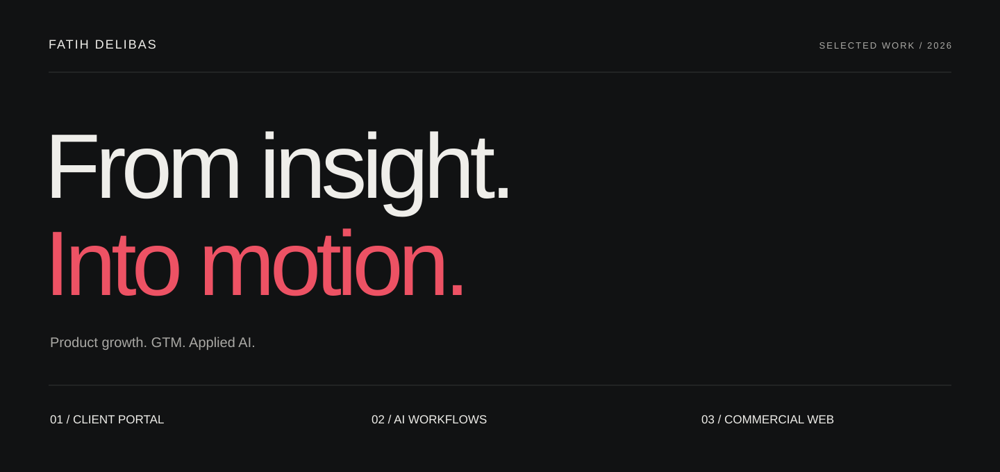

I connect customer insight, commercial thinking and hands-on building to make products and systems people can use.

**[Explore the visual portfolio](https://coop05.github.io/ai-growth-portfolio/)** · **[Explore the live portal](https://portal.fortegrowth.co/demo)** · **[Forte website](https://www.fortegrowth.co/)** · **[Let's talk](https://www.linkedin.com/in/delibasfatih/)**

## 01 / Client GTM portal

A client GTM portal bringing the next action, delivery progress and campaign signals into one workspace. My contribution connects customer research and GTM planning with AI-assisted implementation.

*Three captured views of the public synthetic demo. [View a still](assets/portal-metrics.png) · [Open the live product](https://portal.fortegrowth.co/demo)*

**Three decisions behind the product:** start with the next action; give performance numbers context; distinguish plan progress from completed work.

[Read the product case study](case-studies/client-portal.md)

## 02 / AI workflow system

A shared AI workspace for research, content and GTM delivery. Reusable context, explicit outputs and feedback that stays with the team.

| Source | Working system | Reviewable output |
|---|---|---|
| Customer conversations | Shared context + task-specific workflows | Decisions, owners and next steps |
| Meeting notes | Writing brief + evidence checks | Review-ready content drafts |

[Explore the system](case-studies/ai-workflow-system.md) · [Inspect an action package](examples/meeting-to-actions.md) · [Inspect a content workflow](examples/content-workflow.md)

## 03 / Forte Growth website

A live commercial website connecting a complex GTM offer with clear customer situations, product evidence and a next step. Built through AI-assisted development as part of my work at Forte Growth.

[Visit the website](https://www.fortegrowth.co/) · [Read the case study](case-studies/forte-website.md)

## Experience behind the work

Before Forte, at **Sensor Tower**, I helped grow StayFree Desktop from launch to **55K+ active devices**, supported its browser extension beyond **1M active users**, and managed close to **$500K in paid acquisition spend**. I conducted **40+ user interviews per month**, working with Product, Engineering and Marketing.

Those results belong to that earlier role, separate from the Forte projects above.

## Something worth building together?

London-based. Product growth, GTM and applied AI.

**[Connect on LinkedIn](https://www.linkedin.com/in/delibasfatih/)**

---

Forte projects are team work; the case studies describe my contribution. Portal screenshots show the public synthetic demo. Workflow examples use fictional inputs. [Scope & evidence](SCOPE.md).

The repository also includes a responsive portfolio in `index.html`. The opening motion study is a procedural 3D composition inspired by my interests in tennis and Formula 1. Court and Apex controls change the composition; a pause control stops animation. Products have concise descriptions, direct demo links, manual screenshot tabs and a native zoomable screenshot viewer. There is no scroll-controlled product tour.

Presentation lives in `style.css` and `script.js`. The page uses one font family, Manrope, across headings, body text and controls, with fallback fonts only when it cannot load. There is no build step, external 3D library or JavaScript package dependency. Canvas rendering pauses off screen and when the tab is hidden. Reduced-motion preferences start with a still composition. The mobile layout includes the same motion study, readable product crops and swipe navigation. Product links and the first screenshot remain usable without JavaScript.
